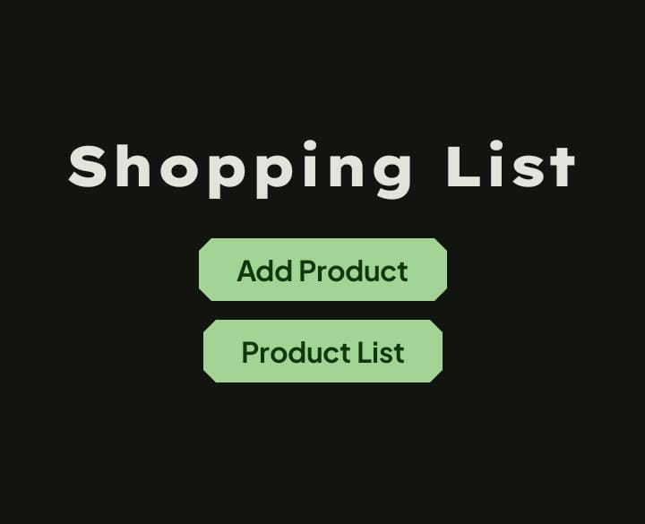
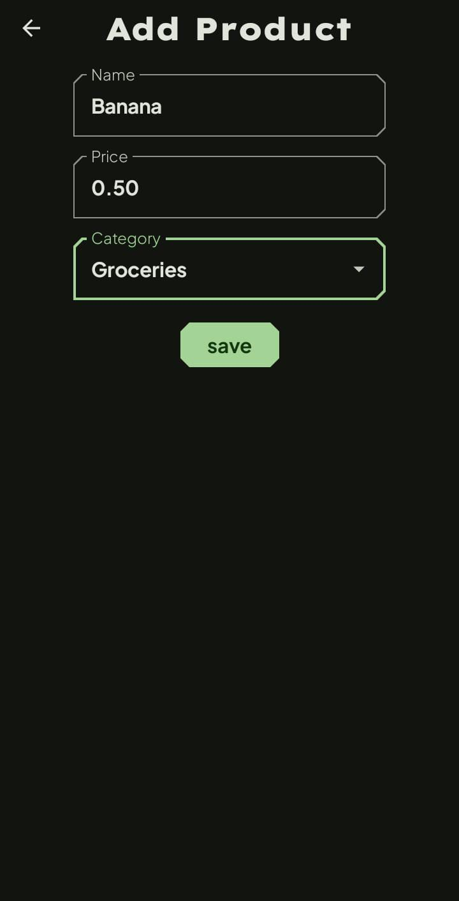
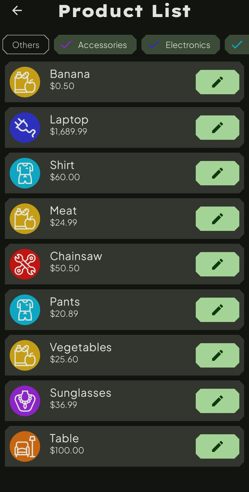
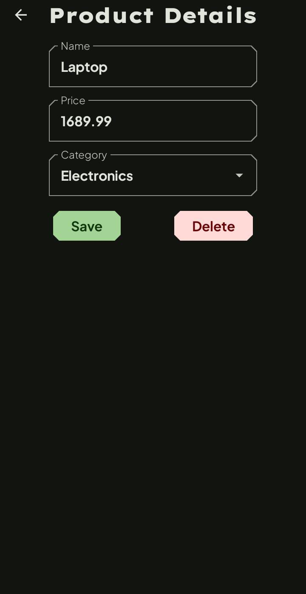

# 🛒 Shopping List

A simple Android application built with **Jetpack Compose**, following the **MVVM architecture**, and using **Room** for local database storage. The app allows users to manage their shopping list by adding, editing, deleting, and filtering products by category.

## ✨ Features

- Add new products with name, price, and category.
- View a complete list of products.
- Filter the product list by category.
- Edit or delete existing products.

## 🖼️ Screenshots

### 🏠 Home Screen  
Allows you to navigate to the product list or add a new product.

---

### ➕ Add Product  
Fill out the form to add a new product with a name, price, and category.

---

### 📋 Product List  
Shows all added products with category icons and allows filtering by category.

---

### ✏️ Edit Product  
Edit or delete an existing product entry.

## 🛠 Tech Stack

- **Kotlin**
- **Jetpack Compose** – Modern declarative UI toolkit
- **Room** – SQLite persistence library
- **MVVM Architecture** – Clean separation of concerns
- **StateFlow & ViewModel** – For reactive state handling
